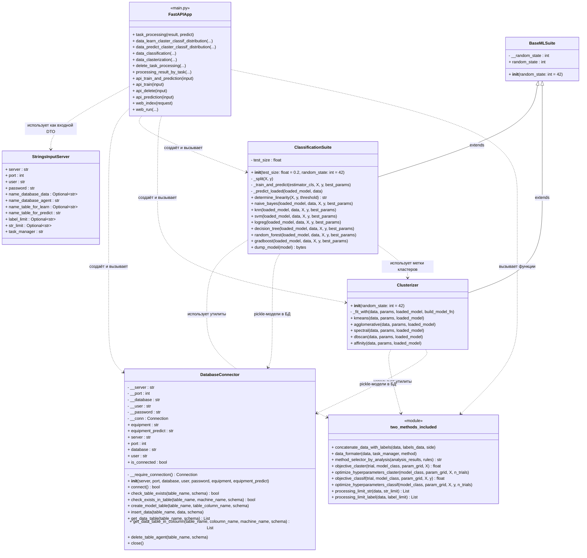

# Система классификации на основе кластеризации данных мониторинга оборудования

## Описание
Выполняется передача параметров и доступ к данным на основе API. 
Интерфейс представлен.

---

## Структура проекта
```
assistant/
 ├── .github/workflows/github-actions-testing.yml   # CI/CD
 ├── main_scripts/
 │    ├── rules/
 │    │    ├── classification_rules.json
 │    │    └── clusterization_rules.json
 │    └── main.py
 ├── src/
 │    ├── rules/
 │    │    ├── classification_methods.py
 │    │    ├── clusterization_methods.py
 │    │    ├── connector.py
 │    │    ├── base_ML_Suite.py
 │    │    └── two_methods_included.py
 ├── ui/
 │    ├── static/
 │    │    └── style.css
 │    ├── templates/
 │    │    ├── index.html
 │    │    └── result.html
 ├── test/
 │    ├── test_API.py
 │    └── test_database.py
 ├── requirements.txt
 ├── .gitignore
 └── README.md
```

---

## Используемые технологии
1. Язык программирования: **Python 3.10+**  
2. Управление зависимостями: **requirements.txt**  
3. Модульное тестирование: **pytest**   
4. CI/CD: **GitHub Actions**  
5. Проверка стиля кода: **pycodestyle (PEP8)**
6. Интерфейс: **jinja2**

---

## Инструкция по запуску

### Клонирование репозитория
```bash
git clone https://github.com/<ваш_логин>/PTLab2.git
```

### Создание баз данных PostgresSQL (обязательно для полной работы создать два экзепляра)
```bash
CREATE DATABASE <ваше_название_базы_данных> OWNER postgres;
```

### Установка переменной окружения с паролем PostgreSQL (или настройте PostgreSQL вручную)
```bash
$env:DATABASE_PASSWORD = "ps_password"
```

### Установка зависимостей
```bash
pip install -r requirements.txt
```

### Запуск тестов
```bash
pytest tests
```

### Проверка стиля кода (PEP8)
```bash
pycodestyle src tests main_scripts
```

### Запуск программы
```bash
python main_scripts/main.py
```

Перейти в браузере по адресу: http://127.0.0.1:8000
---

## Диаграмма классов
